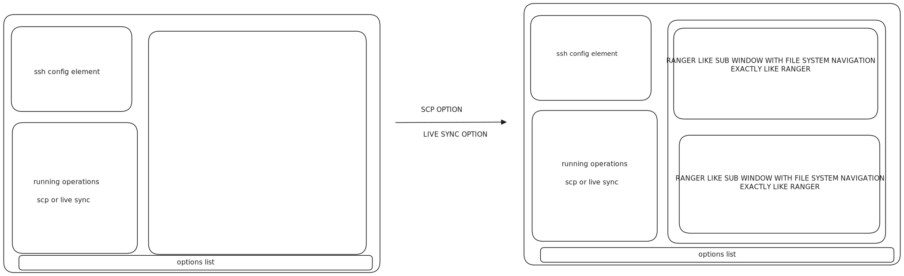

# lazyscpsync

A terminal UI tool for SSH file transfer and live synchronization, built with [Bubble Tea](https://github.com/charmbracelet/bubbletea) and [Lip Gloss](https://github.com/charmbracelet/lipgloss).



## Features

- **SSH Host Management** - Reads hosts from `~/.ssh/config`, add/delete hosts via TUI
- **Host Reachability** - Automatic background connectivity checks with status indicators
- **Local File Browser** - Navigate local filesystem with scroll, icons, and file sizes
- **Remote File Browser** - Browse remote filesystems over SSH with auto-fetch on navigation
- **SCP Transfer** - Multi-stage dialog: select source/dest, mark files, confirm command, execute
- **Live Sync** - Continuous file synchronization using [livesync](https://github.com/bstollnitz/livesync) with watch mode and git-exclude options
- **Process Management** - Track running SCP/sync processes, batch kill via checkbox dialog
- **Create Folders** - Create new directories on local or remote filesystems during transfers

## Project Structure

```
lazyscpsync/
├── main.go                          # Entry point
├── go.mod                           # Go module
├── pkg/
│   ├── app/app.go                   # Application bootstrap (Bubble Tea program)
│   ├── config/
│   │   ├── app_config.go            # Build metadata and paths
│   │   └── user_config.go           # User-editable YAML config
│   ├── commands/
│   │   ├── host.go                  # SSH host reader + manager
│   │   ├── file.go                  # Local filesystem operations
│   │   ├── remote_fs.go             # Remote filesystem via SSH
│   │   ├── scp.go                   # SCP file transfer
│   │   ├── sync.go                  # Sync session tracking
│   │   └── os.go                    # Shell execution wrapper
│   └── gui/
│       ├── bubbletea_model.go       # Model, Update, Init, all handlers (~2400 lines)
│       ├── render_bubbletea.go      # View, all render/overlay functions (~1200 lines)
│       ├── render_panels.go         # Panel content renderers (hosts, files, console)
│       ├── styles_bubbletea.go      # TRON color theme and StyleBuilder
│       ├── messages.go              # Bubble Tea message types
│       └── presentation/            # Display formatting helpers
│           ├── hosts.go
│           ├── files.go
│           └── syncs.go
```

## Building

Requirements:
- Go 1.22+

```bash
go mod download
go build -o lazyscpsync .
```

## Running

```bash
./lazyscpsync
```

## Keybindings

### Global

| Key | Action |
|-----|--------|
| `Tab` | Cycle focus between sections |
| `Shift+Tab` | Cycle focus backwards |
| `q` / `Ctrl+C` | Quit |
| `s` | Start SCP transfer dialog |
| `l` | Start Live Sync dialog |
| `z` | Show active processes (checkbox kill dialog) |
| `a` | Add new SSH host |
| `d` | Delete selected host |
| `f` | Fetch remote files for selected host |

### Navigation (Hosts / File Browsers)

| Key | Action |
|-----|--------|
| `Up` / `k` | Move selection up |
| `Down` / `j` | Move selection down |
| `Right` / `Enter` | Enter directory |
| `Left` / `Backspace` | Go to parent directory |

### SCP Dialog Flow

1. Confirm start
2. Select source (Local/Remote)
3. Select destination (Local/Remote)
4. Mark source files (`Space` to toggle, `Enter` to confirm)
5. Browse destination path (`n` to create folder, `Enter` to confirm)
6. Confirm constructed command (`Enter` to execute)

### Live Sync Dialog Flow

1. Confirm start
2. Browse local source path (`t` to select folder)
3. Browse remote destination path (`t` to select folder, `n` to create folder)
4. Toggle sync options (`Space` to toggle):
   - `no-watch` - One-shot sync instead of continuous watching
   - `standard-git-exclude` - Include git metadata, exclude rest of .git
5. Confirm constructed livesync command (`Enter` to execute)

### In All Dialogs

| Key | Action |
|-----|--------|
| `b` | Go back to previous step |
| `Esc` | Cancel dialog |

### Active Processes Dialog

| Key | Action |
|-----|--------|
| `Up` / `Down` | Navigate process list |
| `Space` | Toggle process selection |
| `.` | Kill all selected processes (SIGKILL) |
| `z` / `Esc` | Close dialog |

## Layout

```
┌──────────────────────┬──────────────────────┐
│  SSH HOSTS           │  STATUS / PROCESSES  │
│  (reachability dots) │  (running/watching)  │
├──────────────────────┴──────────────────────┤
│  LOCAL FILES           │  REMOTE FILES      │
│  (file browser)        │  (file browser)    │
├─────────────────────────────────────────────┤
│  CONSOLE LOG                                │
├─────────────────────────────────────────────┤
│  Footer: keybinding hints                   │
└─────────────────────────────────────────────┘
```

## Configuration

### SSH Config

Hosts are automatically read from `~/.ssh/config`:
```
Host myserver
    HostName 192.168.1.100
    User ubuntu
    Port 2222
    IdentityFile ~/.ssh/id_rsa
```

### Supplementary Hosts

Manually added hosts are saved to `~/.config/lazyscpsync/hosts.yml`.

## Dependencies

- [Bubble Tea](https://github.com/charmbracelet/bubbletea) - TUI framework
- [Lip Gloss](https://github.com/charmbracelet/lipgloss) - Styling
- [fsnotify](https://github.com/fsnotify/fsnotify) - File watching
- [logrus](https://github.com/sirupsen/logrus) - Logging

## External Tools

- `scp` - For file transfers (system SSH)
- `livesync` - For continuous synchronization (must be installed separately)
- `ssh` - For remote file browsing and folder creation

## License

MIT
